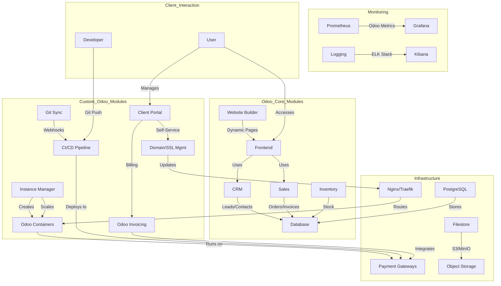

```mermaid
graph TD
    subgraph Odoo_Core_Modules
        A[Website Builder] -->|Dynamic Pages| B[Frontend]
        C[CRM] -->|Leads/Contacts| D[Database]
        E[Sales] -->|Orders/Invoices| D
        F[Inventory] -->|Stock| D
    end

    subgraph Custom_Odoo_Modules
        G[Instance Manager] -->|Creates| H[Odoo Containers]
        G -->|Scales| H
        I[Git Sync] -->|Webhooks| J[CI/CD Pipeline]
        K[Client Portal] -->|Self-Service| L[Domain/SSL Mgmt]
        K -->|Billing| M[Odoo Invoicing]
    end

    subgraph Infrastructure
        H -->|Runs on| N[Docker/K8s]
        J -->|Deploys to| N
        O[Nginx/Traefik] -->|Routes| H
        P[PostgreSQL] -->|Stores| D
        Q[Filestore] -->|S3/MinIO| R[Object Storage]
    end

    subgraph Monitoring
        S[Prometheus] -->|Odoo Metrics| T[Grafana]
        U[Logging] -->|ELK Stack| V[Kibana]
    end

    subgraph Client_Interaction
        W[User] -->|Accesses| B
        W -->|Manages| K
        X[Developer] -->|Git Push| J
    end

    %% Connections
    B -->|Uses| C
    B -->|Uses| E
    L -->|Updates| O
    M -->|Integrates| N[Payment Gateways]
```